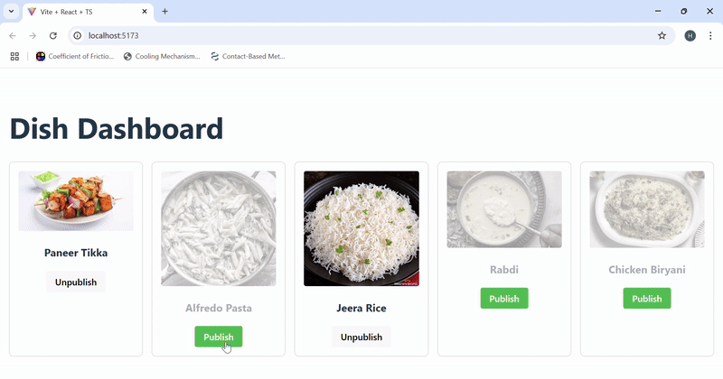

# 🥗 Real-Time Dish Dashboard (React + Vite + Socket.IO)

This project is a **React-based dashboard** that displays dishes fetched from a REST API and supports **real-time updates** when the backend data changes.  

It is designed as a reference implementation for building **real-time client applications** using **Socket.IO** and **MongoDB Change Streams**.

---

## ✨ Features

✅ Fetch and display a list of dishes  
✅ Toggle published/unpublished status  
✅ Automatically reflect changes from other clients or backend updates in real time  
✅ Clean UI with visual cues for unpublished items  

---

## 🛠️ Tech Stack

- **React** (with Vite)
- **TypeScript**
- **Socket.IO Client**
- **Axios**

---

## 🖼️ Demo

!

---

## 🚀 Getting Started

### 1️⃣ Clone the repository

```bash
git clone https://github.com/surefire01/rt-updates-ui.git
cd rt-updates-ui
````

---

### 2️⃣ Install dependencies

```bash
npm install
```

---

### 3️⃣ Configure API URL (optional)

By default, the app expects the backend to be running at:

```
http://localhost:8000
```

If your backend is hosted elsewhere, you can edit the `baseURL` in `App.tsx` or create an `.env` file:

```
VITE_API_URL=http://your-backend-url
```

and update your code to use `import.meta.env.VITE_API_URL`.

---

### 4️⃣ Run the app

```bash
npm run dev
```

---

✅ The app will start on `http://localhost:5173` (or the next available port).

---

## 🧩 How Real-Time Updates Work

1. The app establishes a **Socket.IO connection** to the backend server.
2. When a dish is updated in the backend (via REST API or directly in MongoDB), the backend emits a `dishUpdated` event.
3. The frontend listens for `dishUpdated` and **re-fetches the dishes list automatically**.
4. The UI updates instantly without requiring a manual refresh.

---

## 🖌️ UI Details

* **Unpublished Dishes:**

  * Image faded and greyscale
  * Title faded
  * Button labeled "Publish"
* **Published Dishes:**

  * Normal styling
  * Button labeled "Unpublish"

---

## 📂 Folder Structure

```
📁 src/
  App.tsx         # Main React component
  main.tsx        # App entry point
  types.ts        # TypeScript types
  ...
```

---

## 🖥️ How to Connect to Backend

**Socket.IO Connection Example:**

```typescript
import { io } from "socket.io-client";
const socket = io("http://localhost:8000");

socket.on("dishUpdated", () => {
  // Re-fetch or update UI
});
```

**REST API Example (Axios):**

```typescript
axios.get("/api/dishes");
axios.patch(`/api/dishes/${id}/toggle`);
```

---

## 🌱 Extending This Project

You can enhance this project by adding:

* Authentication (e.g., JWT)
* Pagination or filtering
* Notifications on changes
* Optimistic UI updates
* Deployment configuration

---

## 🧪 Example .env for Production

```
VITE_API_URL=https://your-backend-url
```

---

## ✨ Credits

* [React](https://react.dev)
* [Vite](https://vitejs.dev)
* [Socket.IO](https://socket.io)
* [Axios](https://axios-http.com)

---

## 📄 License

MIT

---
